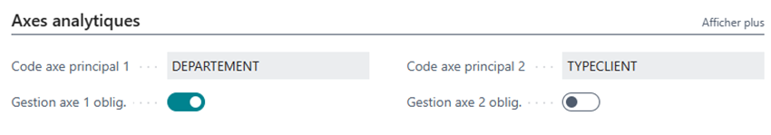
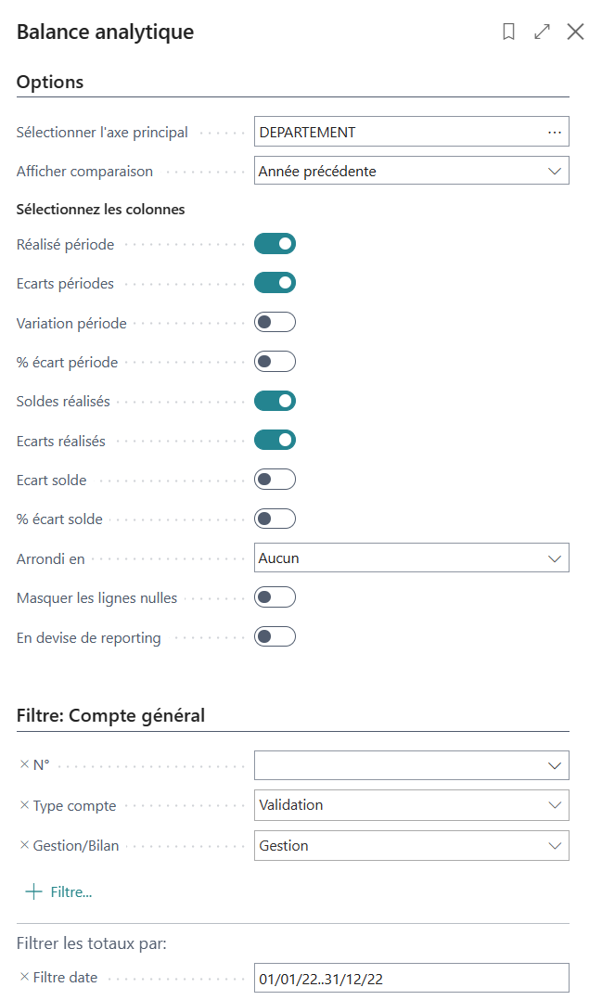
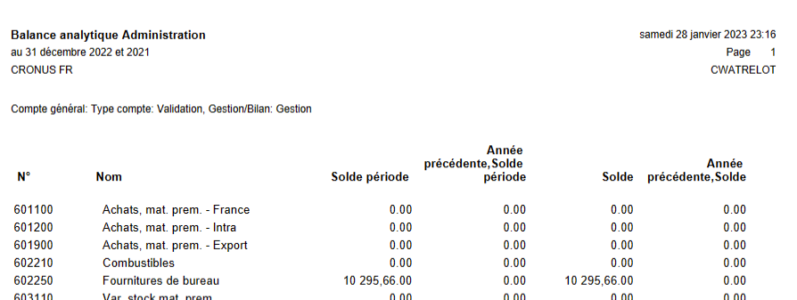
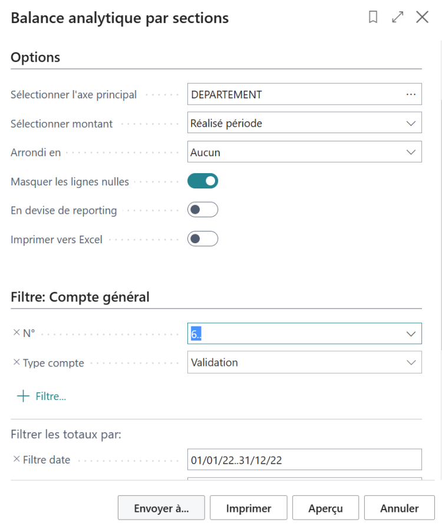
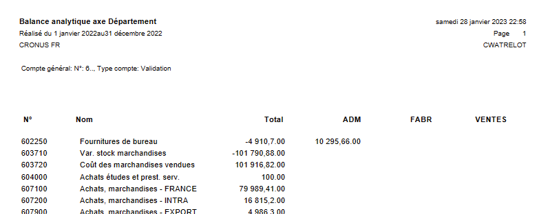

# Extension WanaDim

Business Central dispose d’une fonctionnalité transverse pour associer des 'dimensions' (ou axes et sections analytiques).

L’extension WanaDim met en valeur les 2 principales et permet d’imposer l’une et/ou l’autre pour tous les comptes de gestion.

- [Axes principaux](#axes-principaux)
  - [Obligatoires sur les comptes de gestion](#obligatoires-sur-les-comptes-de-gestion)
  - [Contrôle préventif](#contrôle-préventif)
  - [Disponibles sur les fiches](#disponibles-sur-les-fiches)
- [Balances analytiques](#balances-analytiques)
  - [Présentation en liste](#présentation-en-liste)
  - [Présentation en colonnes](#présentation-en-colonnes)

## Axes principaux
### Obligatoires sur les comptes de gestion

Les **Paramètres comptabilité** permettent de définir 2 axes principaux.

Les options **Gestion axe 1 oblig.** et **Gestion axe 2 oblig.** y sont ajoutées :

Leur activation permet de rendre celle-ci implicitement obligatoire lors de la création d’un compte général dont le **Compte de résultat/Bilan** est *Gestion*.

Si l’une de ces 2 options est modifiée, tous les comptes de gestion seront modifiés.

### Contrôle préventif
Si l’imputation sur l’un des axes sur les lignes des document de ventes et d’achat est contrôlée lorsque celui-ci est lancé.

Cela réduit le risque de constater tardivement que ces informations ont été omises.

### Disponibles sur les fiches
Les 2 axes principaux sont ajoutés aux principales fiches auxquels il sont associés (compte général, article, ressource, immobilisation) afin d’inciter les utilisateurs à les renseigner.

## Balances analytiques
Aussi surprenant que cela puisse paraître, la version standard, dans sa localisation française, ne propose pas de balance analytique !

Il est bien sûr possible, avec un peu de patience, d’imprimer une balance générale avec un filtre sur une section (de l’un des deux axes principaux), et ce pour chacune des sections 🙁

En revanche, la localisation nord-américaine de Business Central propose deux états à cet effet, alors, plutôt que d’y transférer votre société, ce sont ces deux états qui viennent à vous !

Ces états s’appliquent à l’un des 2 axes principaux et se déclinent en plusieurs variantes selon les options retenues.
* La première est est de présentation similaire à la balance générale, mais pour chacune des sections (mentionnée dans le titre).
* *La seconde reprend les informations de chacune des sections en colonnes.

### Présentation en liste

### Présentation en colonnes

